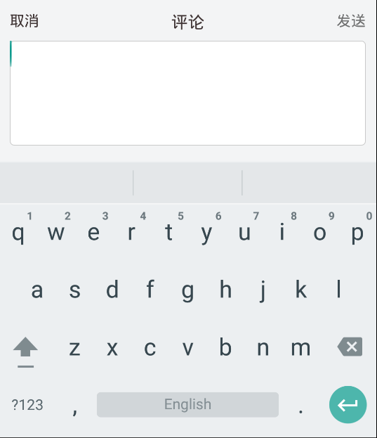

title: 解决软键盘和dialog一同消失的问题
date: 2015-10-29 16:18:45
tags:
- Android
- 软键盘
- dialog

---

### 前言

最近在做一个关于分享经验贴的一个App，其中文章详情界面出现了一个问题就是在界面的最下面有一条操作栏，其中有一项就是一个小的输入框,点击小的输入框，界面样式如下：



点击左侧的写评论的输入框，会出现如下界面:

这个界面是从底部弹出的一个Dialog，也可以用[透明的Activity实现](http://www.javabeat.net/dialog-activity-android/),我这里使用的是github上的一个[开源的Dialog库](https://github.com/H07000223/FlycoDialog_Master)，因为动画设置，以及界面设置都比较方便，所以就用了这个，但是示例中没有我的这个应用场景，基本上就是一些条目点击选择的示例.

### 问题描述

但是我们的项目中存在的问题就是当点击弹出Dialog的时候，要同时弹出软键盘，当点击返回键和或点击除Dialog的其他地方的时候，让Dialog和软件盘同时消失，就因为这个事搞了一天，最后还是借助别人的帮助实现的，但是还是想发出来供以后遇到该问题的朋友参考:

### 解决方案

以下是解决方案，**是通过计算弹出软键盘之前和之后的高度变化，来实现关闭Dialog的**，在你创建的Dialog文件的**OnCreateView()**方法中添加如下代码:

	//监听视图树的布局变化
	view.getViewTreeObserver().addOnGlobalLayoutListener(new ViewTreeObserver.OnGlobalLayoutListener() {
	            public void onGlobalLayout() {

	                int[] locations = new int[2];
	                
	                //计算该视图在全局坐标系中的x、y值，这个值是从屏幕顶端算起的，包括了通知栏的高度；得到的是当前屏幕内的绝对坐标
	                view.getLocationOnScreen(locations);
	                int y = locations[1];
	                if (oldY != 0 && oldY < y) {
	                    //从小变大 说明关闭了输入法
	                    Logger.d("y的值是:" + y + "oldY的值是:" + oldY);
	                    hide();
	                }
	                oldY = y;
	            }
	        });

			//dialog的cancel事件的监听方法
			
	        setOnCancelListener(new OnCancelListener() {
	            @Override
	            public void onCancel(DialogInterface dialog) {
	                imm.hideSoftInputFromWindow(mEtComment.getWindowToken(), 0);
	            }
	        });

			//dialog的show事件的监听方法
			
	        setOnShowListener(new OnShowListener() {
	            @Override
	            public void onShow(DialogInterface dialog) {
	                imm.toggleSoftInput(InputMethodManager.SHOW_FORCED, 0);
	            }
	        });
	
### 总结
        
还有一点值得注意的就是在点击事件中**showDialog**的时候，一定要创建和show写在一起，如果将创建Dialog写在Activity中**onCreate**方法中，在点击事件中写**show**的话，就会存在，键盘第一次出现，可是当点击返回键让Dialog消失了之后，再点击让他显示的时候，就只会显示Dialog，不会显示软键盘，尽管我在Dialog的文件中写了show的监听事件，但是还是没什么效果，很是郁闷，希望找到解决方案的同学可以告知我。